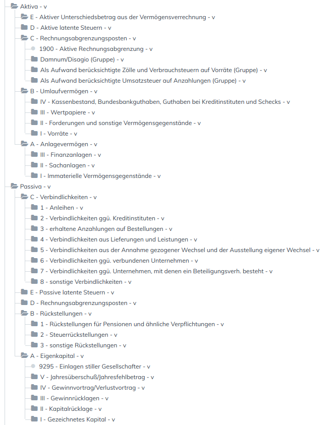

> In Entwicklung. Einsatz in Produktivsystemen derzeit noch nicht empfohlen.

Standardkontenrahmen (SKR) 04 für ERPNext.

Sponsored by [//SEIBERT/MEDIA](https://www.seibert-media.net/) and [tüit](https://www.tueit.de/).

* `de_skr_hgb.json` enthält die Struktur von Bilanz und GuV-Rechnung nach HGB, **ohne** Konten,
* `de_skr04_hgb.json` enthält die Konten des SKR 04, eingeordnet in die Struktur von Bilanz und GuV-Rechnung nach HGB.
* [SKR03 von spritelite](https://github.com/spritelite/SKR03/blob/master/de_kontenplan_SKR03_UKV.json)




ERPNext bucht nach dem Umsatzkostenverfahren:

|   |                               |
|---|-------------------------------|        
|   | Umsatzerlöse 
| – | Herstellungskosten
| = | **Bruttoergebnis vom Umsatz**
| – | Vertriebskosten
| – | allg. Verwaltungskosten
| + | sonst. betriebliche Erträge
| – | sonst. betriebliche Aufwendungen
| = | **operatives Ergebnis**
 


Der Kontotyp bewirkt, dass an den entsprechender Stelle in ERPNext nur Konten dieses Typs angeboten werden. Außerdem werden die Standardkonten beim Erstellen eines neuen Unternehmens anhand der Kontentypen gesetzt.

### Testen 

```bash
scp de_skr04_hgb.json my.erp.com:/home/frappe/frappe-bench/apps/erpnext/erpnext/accounts/doctype/account/chart_of_accounts/verified/
ssh my.erp.com
cd frappe-bench/ && bench clear-cache
```

* [Mehr zu SCP](https://unix.stackexchange.com/a/106482)
* [Mehr zu Bench](https://frappe.io/docs/user/en/bench/resources/bench-commands-cheatsheet)


### DATEV Report

1. New Report

    Ref DocType: GL Entry
    Report Type: Query Report
    Query: SQL aus `datev_report.sql`
    
2. Show Report


* Die von ERPNext generierte CSV-Datei wird sich auch in DATEV Unternehmen Online importieren lassen. Siehe dazu folgende Anleitung:  https://www.datev.de/dnlexom/client/app/index.html#/document/1070909

### Notizen

* Die Konten für Löhne und Gehälter sind unter Herstelllungskosten angesiedelt. Für eine korrekte GuV-Rechnung muss der Personalaufwand für allgemeine Verwaltungskosten und Vertriebskosten umgebucht werden.

* Die Länge der Kontennamen ist auf 140 Zeichen beschränkt.

* Die führenden Nummern der Wurzel- und Gruppenkonten stammen aus dem Handelsgesetzbuch. Sie sind nur für den Jahresabschluss relevant.

* Inventurdifferenzen bei den Roh-, Hilfs- und Betriebsstoffen werden zu Lasten des Kontos *Herstellungskosten der zur Erzielung der Umsatzerlöse erbrachten Leistungen* gebucht.

### Weiterführende Links

* [CSV-Datensatzbeschreibung](https://www.datev.de/dnlexom/v2/content/files/st1284022283.pdf) von DATEV

### Lizenz

Copyright (C) 2019 Raffael Meyer <raffael@alyf.de>

This program is free software: you can redistribute it and/or modify it under the terms of the GNU General Public License as published by the Free Software Foundation, either version 3 of the License, or (at your option) any later version.

This program is distributed in the hope that it will be useful, but WITHOUT ANY WARRANTY; without even the implied warranty of MERCHANTABILITY or FITNESS FOR A PARTICULAR PURPOSE. See the GNU General Public License for more details.

You should have received a copy of the GNU General Public License along with this program. If not, see https://www.gnu.org/licenses/.
