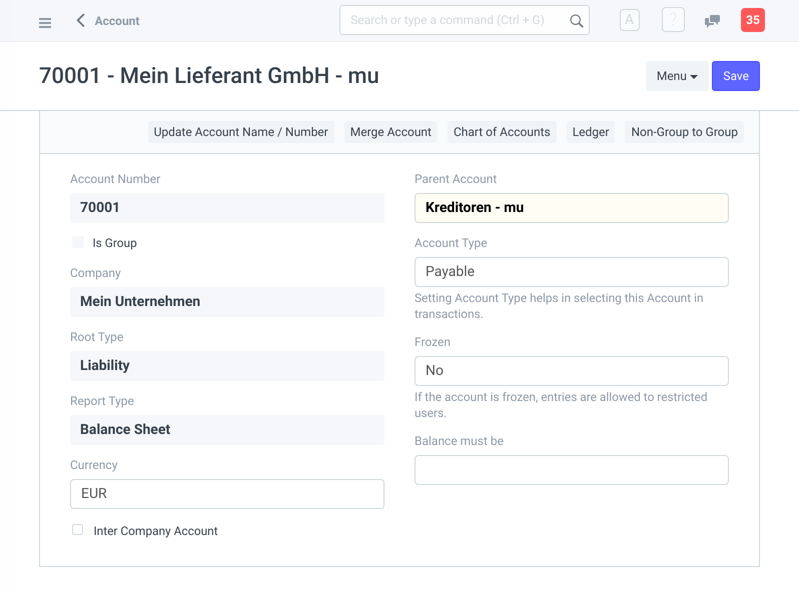
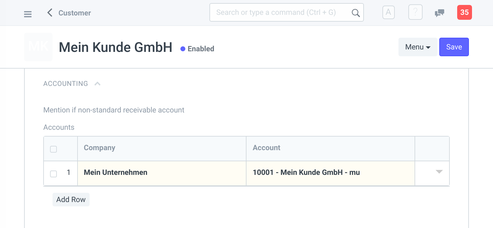
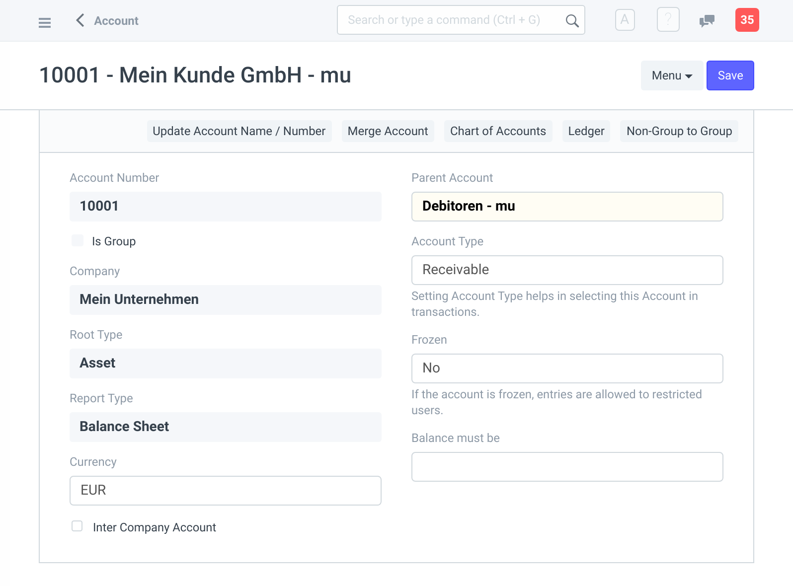
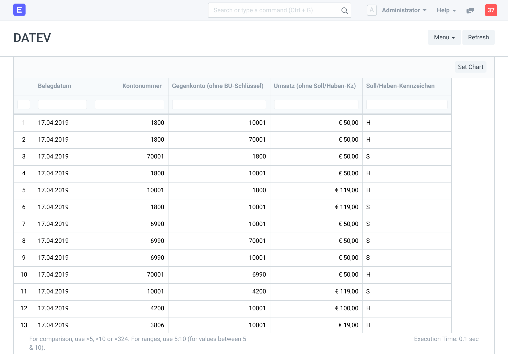

## Kreditoren

Als Erstes legen wir einen Lieferanten an. Im Abschnitt _Default Payable Accounts_ (Zahlbare Konten) tragen wir unser Unternehmen und ein Kreditorenkonto ein.

Falls das Kreditorenkonto noch nicht existiert, legen Sie im Kontenplan unter Kreditoren ein neues an. Der _Account Type_ (Kontotype) muss dabei auf `Payable` (Zahlbar) gesetzt werden.

Im SKR 04 sind für Kreditoren die Kontonummern 70000 - 99999 reserviert. Falls Sie einen Buchhalter oder Steuerberater haben, fragen Sie, ob diesem Lieferanten schon eine Nummer zugewiesen wurde. 

Nun können Sie, wie oben erwähnt, das Kreditorenkonto dem Lieferanten zuordnen.

Wir erstellen für diesen Lieferanten eine _Purchase Invoice_ (Eingangsrechnung) über ein Produkt in Höhe von 50,00 €. Diese Rechnung bezahlen wir auch gleich und erstellen einen entsprechenden _Payment Entry_.

## Debitoren

Nun weiter zu den Debitoren. Wir legen einen neuen Kunden an und setzen im Abschnitt _Accounting_ das Debitorenkonto.

Falls das Debitorenkonto noch nicht existiert, legen Sie im Kontenplan unter Debitoren ein neues an. Der _Account Type_ muss dabei auf `Receivable` (Forderung) gesetzt werden.

Im SKR 04 sind für Debitoren die Kontonummern 10000 - 69999 reserviert. Falls Sie einen Buchhalter oder Steuerberater haben, fragen Sie, ob diesem Kunde schon eine Nummer zugewiesen wurde. 

Wir erstellen für diesen Kunde eine _Sales Invoice_ (Ausgangsrechnung) über das selbe Produkt wie oben in Höhe von 100,00 €. Wir nehmen an, dass die Rechnung sofort bezahlt wurde und erstellen einen entsprechenden _Payment Entry_.

## Report

Im _Report_ (Bericht) namens "DATEV" können wir alle Buchungssätze sehen, die durch die Rechnungen und Zahlungen entstanden sind. Diese lassen sich für unseren Steuerberater oder _DATEV Unternehmen Online_ als CSV-Datei exportieren.

